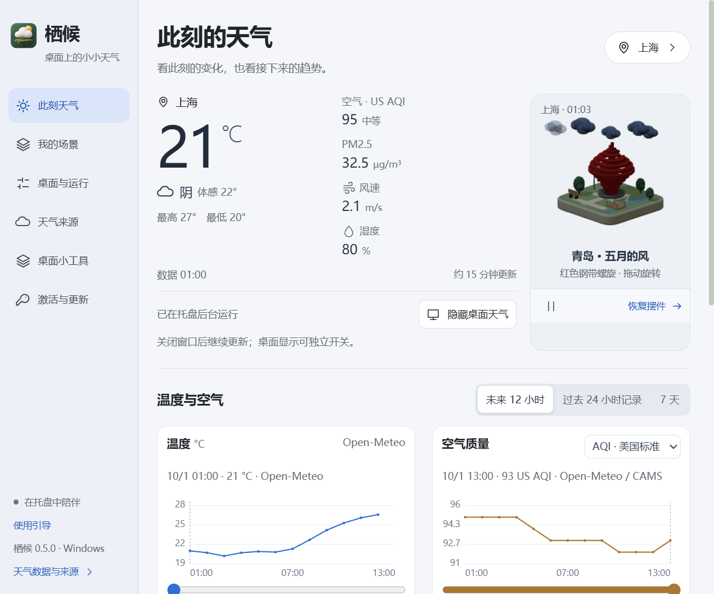
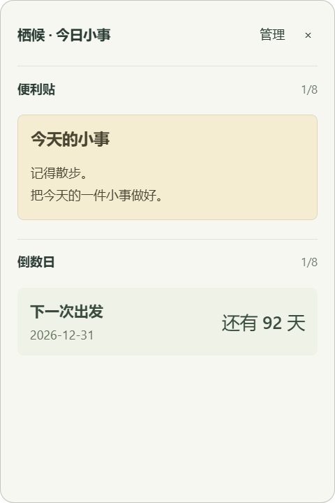

# 栖候 · 桌面 3D 天气与小工具

让天气住进桌面，也给小事留一个位置。Windows x64 原生托盘应用，Electron + TypeScript + Three.js。

[下载最新安装器](https://github.com/Sunnymark7/qihou-desktop/releases/latest) · [安装说明](docs/installation.md) · [激活与签发](docs/activation.md) · [发布与 OTA](docs/publishing.md)



## 功能

- 启动进入托盘，设置按需打开，关闭后继续后台运行；窗口不占任务栏。
- 透明摆件直接拖动、位置记忆、穿透、置顶、独立显示开关；实验性动态壁纸。
- Apple 风格控制面板、可跳过和重看的首次使用引导；内置 54 城中文与拼音检索、自动匹配 20 城地标。
- 城市或 WGS84 经纬度定位，四个天气源切换、约 15 分钟更新，显示来源与数据时间。
- 15 类天气：雷雨、冰雹、雨夹雪、雷雪等。风向袋、树冠表达风力，云朵在建筑后方漂移。
- 温度、AQI、PM2.5、PM10 曲线，12 小时预报与本机记录，滑块和数据表读取数值。空气独立采用美国 AQI 与 CAMS 模型。
- 上海、广州、北京、深圳、武汉、杭州、西安、成都、重庆、天津、苏州、南京、郑州、青岛、长沙、厦门等 20 城地标；换建筑不改变天气地点。
- GitHub OTA 签名与哈希核验后，由用户选择下载、安装和重启。

## 免费与 Plus

| 功能 | 免费 | Plus |
| --- | --- | --- |
| 天气、摆件、20 个经典地标、更新 | ✓ | ✓ |
| 12 小时预报、24 小时本机记录 | ✓ | ✓ |
| 精雕建筑、幕墙、夜景 | | ✓ |
| 便利贴、倒数日，各 8 条 | | ✓ |
| 苔庭 / 海盐 / 樱信 / 星夜皮肤 | 苔庭 | 四套 |
| 收藏地点，最多 8 个 | | ✓ |
| 7 天记录、CSV 导出 | | ✓ |
| 到期后查看、复制、删除笔记、JSON 备份 | ✓ | ✓ |

Plus：**¥1 / 7 天体验**、**¥5 / 当前设备永久**。人工核款签发，购买入口未配置，无自动收款或发码。体验自签发起计，见 [激活说明](docs/activation.md)。



## 使用

从 Releases 下载 Qihou-0.4.0-Setup-x64.exe，向导可选目录与当前用户/所有用户。首次从托盘选择地点，不自动推断地址。桌面无工具条，托盘打开设置或恢复位置。Ctrl+Alt+W 在未被占用时恢复编辑。

“桌面小工具”创建便签和倒数日，勾选“放在桌面”后显示独立面板，拖标题栏移动。三种纸张，内容只保存在本机；倒数日按本机日历计算，不是闹钟。皮肤改变岛屿、植被和卡片，保留建筑本色。

## 开发

本机验证 Node.js 24.18.0、Windows x64，锁定依赖见 package-lock.json。

```powershell
npm ci --include=optional
npm test
npm run build
npm start
npm run dist
node scripts/smoke.cjs --packaged
```

dev 仅浏览器设计预览，使用标记的演示数据。smoke 使用隔离配置、公开上海坐标，不改用户配置和启动项，截图存 .test-data。发布私钥只存本机，不随源码、应用或安装器分发。普通贡献者可构建免费版，单元测试用临时密钥，不能签发官方激活码或更新清单。

## 数据和边界

动画不代表秒级实测。无地图选点、门牌级编码或灾害预警。空气质量单源，故障保留缓存。免费 Open-Meteo 端点面向非商业使用；**正式收款前需取得适用的天气、空气和地理编码服务方案**，未购买商用额度。其他服务条件见 [来源说明](docs/api-sources.md) 与 [第三方声明](THIRD_PARTY_NOTICES.md)。

天气发送必要地名和坐标，更新访问 GitHub；便签、倒数日、激活码、个人 API 密钥不上传。模型为原创微缩示意，不是测绘复刻；图标由 ChatGPT 生成。[GitHub 调研](docs/github-research.md) 记录参考。本仓库公开源码，激活不能保证抵抗修改客户端或复制配置，无云端撤销。

安装器没有 Windows 代码签名，OTA 独立使用 Ed25519 与 SHA-512。本机完成自动化和截图验证，尚未覆盖全部系统、显卡、混合 DPI、长期运行和实际系统安装升级。壁纸实验性。见 [发布记录](docs/release-0.4.0.md)。
