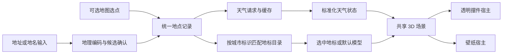

# 桌面 3D 天气：产品与技术设计提案

版本：0.1 · 2026-09-11。状态：调研后的设计提案，尚未实现、实测或确认为最终美术方案。

用户已确认：透明小摆件和动态壁纸都需要，先做透明小摆件。本文的产品布局、技术选型和数值是供评审的建议。

## 1. 产品核心

桌面上放置一处会随当地天气和昼夜变化的 3D 微缩景观。用户可以选择家乡地标，也能保留默认景观；云、雨、雪、风和光照体现天气，旁边的简短文字提供准确数值。应用运行后进入托盘，设置按需打开。

设计示例：用户选择“上海市浦东新区”，使用东方明珠主题场景。下雨时场景出现随风倾斜的雨线，地面增加湿润反光；入夜后建筑灯光渐亮。这里的城市和地标仅用于说明，当前没有对应模型资产，示例也不代表真实天气。

## 2. 两种展示形式

| 项目 | 第一阶段：透明小摆件 | 第二阶段：动态壁纸 |
| --- | --- | --- |
| 使用位置 | 桌面一角，可拖动和缩放 | 桌面图标后方，覆盖所选屏幕 |
| 构图 | 单个地标/默认模型、局部地景与天气 | 扩展地景和天空，复用同一主题 |
| 信息密度 | 地点、温度、天气、数据新旧 | 默认更少，位置可调 |
| 控制入口 | 托盘；编辑模式下可直接操作摆件 | 托盘和设置窗口 |
| 窗口行为 | 常驻透明窗口，置顶是可选项 | 专用壁纸宿主、桌面挂载和恢复 |
| 资源策略 | 默认 30 FPS，锁定/隐藏/全屏时按规则降耗 | 分屏暂停；避免被全屏应用遮住时继续满速绘制 |

第一版摆件是桌面上的透明窗口；它不天然等同于嵌入图标层后的桌面对象，也不能通过 `alwaysOnBottom` 就承诺完整壁纸行为。是否始终置顶由用户设置，默认建议关闭。单纯置底和 Windows“显示桌面”行为必须实际测试。

## 3. 界面与交互

### 3.1 摆件

建议初始尺寸约 320 × 320 逻辑像素，支持约 220–600 的缩放范围；以实际长地名、多语言和 DPI 测试为准。

内容自上而下为：稀疏天气层 → 主体地标/模型 → 低矮地景 → 小型天气信息。主体建议占视觉面积约三分之二。采用固定斜俯视角，保持地标轮廓可识别；镜头旋转放到编辑状态，常驻状态不持续旋转。

文字结构示意（以下数值为演示）：

```text
        云层 / 雨雪 / 太阳或月亮
             3D 地标
            微缩地景

   上海 · 浦东       24°
   小雨 · 体感 25°
   数据时间 14:15   [离线时显示状态]
```

常驻信息按“温度 → 天气 → 地点 → 新鲜度”建立阅读顺序。风速、湿度和短时预报在点击后的详情面板中呈现。文字使用独立 HTML 层，便于缩放、辅助技术读取；字体选 Windows 系统 UI 字体与中文回退，文字底部提供可选衬底，适应明暗壁纸。

美术建议为轮廓清晰、材质克制的微缩模型；不把生成图片当作可旋转 3D 模型。最终材质、配色和效果图仍需后续视觉设计确定。

### 3.2 编辑与锁定

- 编辑模式：可拖动、缩放、打开详情和切换模型。独立拖动手柄避免模型旋转与拖窗争抢输入。
- 锁定模式：整体鼠标穿透，减少遮挡桌面操作；不能依赖悬停来解锁。
- 托盘始终提供“编辑摆件”“锁定并穿透”“显示摆件”“重置位置”。可增设用户可修改的恢复快捷键。
- 第一版不以鼠标位置逐帧切换穿透，不把透明背景自动穿透当成已解决的事实。

### 3.3 托盘行为

启动先建立托盘和单实例保护，再恢复配置。有地址时直接显示上次摆件，设置窗口保持关闭；没有地址时托盘提示“选择天气地点”，可显示标注“尚未设置地点”的静态默认场景。首次用户通过托盘完成地址和模型选择后开始自动更新，不偷偷使用示例城市。

建议菜单结构：

```text
地点 · 温度 · 天气（未设置/离线时显示对应状态）
打开天气详情…
显示/隐藏摆件
编辑摆件 / 锁定并穿透
场景 → 默认模型 / 当地地标 / 选择地标…
显示模式 → 透明摆件 / 动态壁纸（第二阶段提供）
暂停/恢复动画
立即刷新
设置…
开机启动 [由用户开启]
退出
```

左键建议打开紧凑天气面板，右键显示菜单；关闭详情或设置窗口只关闭该窗口，后台继续运行。“隐藏摆件”“暂停动画”“退出应用”必须是三个明确且不同的动作。退出需结束网络定时器、渲染和壁纸宿主，恢复桌面。

开机启动是可选择的功能，与每次启动进入托盘分开。Explorer 重启后恢复图标；第二次启动唤起既有入口，不能生成第二套天气请求。

### 3.4 设置窗口

按任务划分四组：

| 页面 | 主要内容 |
| --- | --- |
| 地点与天气 | 地址/地名输入、带行政区的候选列表、地图选点或坐标输入、数据源、更新状态 |
| 场景 | 默认模型、当地可用地标、主题预览、恢复自动匹配 |
| 桌面显示 | 尺寸、屏幕、位置、置顶、锁定、信息显示、重置位置 |
| 运行与性能 | 开机启动、帧率、画质、电池/全屏策略、减少动态效果、数据与缓存说明 |

设置页以可操作性为主，左侧分组、右侧表单；场景页提供预览。主题切换先加载成功再提交，失败保持原模型并提供默认选项。预览天气明确标注“演示”，不能污染真实天气状态。

## 4. 地址到天气



区分“详细地址”“城市搜索”“天气格点”：输入门牌地址需要具备相应能力的地理编码服务，城市搜索 API 不能默认为门牌级解析。即使获得精确坐标，天气仍受供应商观测/模型分辨率限制。

第一阶段必须覆盖用户按地址选地点的完整流程。可先接城市/区县检索，但详细地址无法解析时，要明确告知并提供地图选点或经纬度输入完成定位；只有城市搜索、没有详细地址替代路径的版本不能宣称完整支持地址功能。

地点记录建议保存 `id、displayName、country、admin1、admin2、latitude、longitude、timezone、source`。时区来自地点，不能直接用电脑时区。坐标体系在接入地图或国内地址服务时单独核验，转换后统一用于天气查询。

位置按用户选择保存，不默认上传完整地址；网络请求发送该服务确实需要的信息。自动定位是可选入口，不作为首次运行的必需权限。

## 5. 数据更新与场景映射

建议天气默认每 10–15 分钟刷新一次，最终按服务商更新节奏与配额调整；手动刷新限频、同地点并发请求合并。网络超时后退避重试，切换地址取消旧请求或忽略旧响应。唤醒与网络恢复时检查是否过期再刷新。

保存 `dataTime、fetchedAt、provider、locationId、temperature、feelsLike、condition、cloudCover、precipitation、windSpeed、windDirection、isDay`，以及有来源依据的 sunrise/sunset；单位显式标准化。供应商专有天气码先转成内部枚举，渲染器不直接使用原始代码。

Open-Meteo current 来自 15 分钟模型数据，具体依据见 [官方文档](https://open-meteo.com/en/docs)。动画连续渲染只负责观感，不产生更高频的新天气事实。

| 天气输入 | 场景响应 | 约束 |
| --- | --- | --- |
| 晴/少云 | 太阳或月亮、柔和阴影、少量慢云 | 昼夜以地点时间和日照数据为准 |
| 多云/阴 | 云覆盖增大、直射光减弱 | 云速可以受风影响，强度做视觉钳制 |
| 小雨/大雨/阵雨 | 不同粒子密度、雨速与湿润程度 | 无可靠降水强度时按天气类别近似，不能伪造精确雨量 |
| 雪/雨夹雪 | 雪粒缓慢漂移，必要时混合雨粒 | 装饰性积雪不代表实测雪深 |
| 雾 | 降低对比度，地标远端淡出 | 无能见度字段时用天气类别，不能只按湿度判断有雾 |
| 雷暴 | 较暗云层、雨和低频局部闪光 | 默认抑制强闪烁；减少动态效果时关闭 |
| 大风 | 雨雪倾斜、云移动和少量植被摆动 | 风向是来向，转成运动向量时明确约定 |
| 未知/缺数据 | 中性场景与“天气暂不可用” | 不把未知天气回退成晴天 |

天气更新建议在 2–5 秒内平滑过渡；数值及时更新并标记时间，不等待动画结束。空气质量、预警、雷达、精确雪深不是首版默认数据；没有对应源时不显示。

首次加载显示正在获取；断网有缓存时保留最后有效场景，标“离线 · 数据时间…”；缓存超过建议 30 分钟新鲜度阈值显示“待更新”，阈值应按供应商配置。无缓存时使用明确的未知状态，不伪造当前天气。

## 6. 地标与默认模型

同一场景预留三个组合层：地景底座、主体模型、天气/光照层。切换模型只换主体及兼容的底座，不改变所选地址的天气。

默认模型建议为一栋小屋、树木和简洁地景，程序化几何即可建立稳定的首版基础。地标通过自制或明确授权的 GLB/glTF 资产逐个加入，统一尺度、中心点、地面高度和灯光语义。

建议地标目录字段：`assetId、cityIds、label、assetPath、scale、groundOffset、cameraPreset、nightLights、author、license、sourceUrl、checksum`。其中城市匹配使用供应商位置 ID 或内部映射，不依赖“上海”一类中文字符串硬匹配。

自动选择次序：用户针对当前地点的明确选择 → 城市目录匹配 → 默认模型。设置页只展示已有并适用于当前地点的地标，显示“该地点暂未收录地标”时仍可用默认模式。切换到其他城市需重新解析选择，不能继续把上一城市地标标成当地地标。

首批建议用默认模型加 1–3 个经过授权核验的地标验证完整流程；北京、上海、广州仅作为候选城市，不是已具备资产。首版不承诺自动下载任意城市地标或由地址生成真实建筑。模型导入与模型商店可后续增加。

## 7. 技术架构建议

推荐以 Tauri 2 + TypeScript + Three.js 进行第一轮技术验证；设置界面可用 React，3D 核心尽量保持独立模块，是否使用 R3F 取决于团队实现偏好。此建议不是“已证明比所有方案更省资源”的结论。

| 层 | 职责 |
| --- | --- |
| 原生应用层（Rust/Tauri） | 托盘、单实例、窗口开关、启动项、配置存储、生命周期、显示器与电源事件 |
| 天气服务 | 地点解析适配、请求调度、超时/重试、缓存、数据时间与单位规范 |
| 状态层 | 当前地点、天气快照、模型选择、展示/暂停状态；向各窗口同步 |
| 场景层（Three.js） | 相机、模型加载、天气效果、昼夜光照、资源释放、画质等级 |
| 展示宿主 | 摆件：透明小窗；壁纸：全屏场景和桌面挂载 |
| 设置/详情界面 | 地点与主题选择、显示设置、状态与故障恢复 |

天气服务建议由原生层统一调度，多个窗口订阅同一份快照，防止每个窗口重复轮询。数据事件带地点和版本，旧城市响应不得覆盖新城市。配置用版本化 JSON 和原子写入；暂不需要数据库、账户系统或云同步。

窗口建议在创建时保持隐藏，背景、画布透明参数和内容就绪后再显示；`decorations=false`、`transparent=true`、`skipTaskbar=true` 是候选配置，不能替代透明合成与 Alt+Tab 行为验收。设置窗口保留常规桌面窗口操作习惯。

候选框架取舍：Tauri 优先验证系统 WebView 与托盘结合；若透明合成等核心验收失败，再用 Electron 或原生 Windows 宿主做对照原型。Godot 也可作为重 3D 方向的备选，但当前产品更需要先验证小型场景与桌面交互。此处是工程判断，不是资源占用测试结果。

如使用商业天气凭据，不能把共享密钥当作安全秘密打包进前端或桌面二进制。个人自用可采用用户自备凭据并使用系统保护存储；公共分发的密钥和服务模式需另行设计。当前阶段无需部署后端。

### 壁纸扩展

先保持 `scene-core` 与宿主无关，提供 resize、pause、resume、setWeather、setTheme 等清晰调用面。二期先验证场景的全屏构图，再验证 Windows 桌面挂载。

可导出 Lively 兼容场景包验证壁纸观感，但这种方式需要安装 Lively，必须显式说明外部依赖。独立应用版仍需实现自己的宿主管理与恢复；不能把导出网页包当作独立壁纸功能已交付。

## 8. 性能与可靠性验收目标

以下全是待实测目标，当前没有 CPU、GPU、内存或帧率基准结果。

- 默认 30 FPS，节能 15 FPS，用户可选更高帧率；默认关闭昂贵后处理。
- 摆件建议模型约 30k–80k 三角面以内，纹理优先 1K，像素比例有上限；实际按地标和目标显卡调节。
- 粒子批处理、几何与材质复用；切换主题释放 GPU 资源。隐藏/锁屏时停止连续绘制，保留低频天气调度。
- 全屏暂停按摆件所在屏幕判定；仅依靠网页 `visibilitychange` 不足以判断被其他窗口遮挡。
- 窗口坐标以逻辑像素保存，拔出显示器后恢复到可见区域，支持负坐标和混合 DPI。
- WebGL 丢失上下文时重建；失败时显示天气文字和静态默认状态，托盘仍可操作。
- 测量应用进程树总内存与 GPU 占用，不能只统计 Rust 主进程；不照搬 TranslucentTB 的资源指标承诺。
- 连续运行至少 8 小时，反复换地点/主题、隐藏/恢复，检查资源是否持续增长。

参考 [Lively 的暂停策略](https://github.com/rocksdanister/lively)，以及 [Tauri 透明窗口问题报告](https://github.com/tauri-apps/tauri/issues/15947)。问题报告用于确定验证重点，不表示本项目已经复现。

## 9. 实施顺序与完成条件

| 阶段 | 交付 | 完成条件 |
| --- | --- | --- |
| 0：桌面技术验证 | 原生托盘 + 透明 3D 测试窗 | 无白/黑底残留；隐藏、恢复、退出正确；锁定可从托盘解锁；Explorer 重启后入口恢复；混合 DPI 可用 |
| 1：天气摆件 MVP | 地址流程、默认模型、天气动态、缓存与设置持久化 | 地点消歧及详细地址替代流程完整；所有天气类别及未知状态可演示验证；真实服务可用；启动直接常驻托盘 |
| 2：地标版本 | 预置地标、手动选择、自动匹配和回退 | 至少一个当地地标和默认模型均可选；换城市不串地标/天气；缺失和加载失败能回退 |
| 3：壁纸模式 | 相同天气场景的桌面壁纸宿主 | 图标层级正常；Explorer 重启、休眠、显示器插拔恢复；全屏按规则暂停；退出恢复原桌面 |
| 4：发布准备 | 安装包、许可/来源说明、目标机验证记录 | 开机启动可开关；安装/卸载正确；无残留进程；数据源和资产发布条件落实 |

优先验证矩阵：目标 Windows 11 版本、常见集显、WebView2、100%/150%/200% DPI；若列入 Windows 10 支持则单独覆盖透明合成问题。版本和硬件清单应由实际目标机确认。

针对性功能验证：同名城市、输入无法解析、断网/限流、未知天气码、地点快速切换导致乱序响应、跨时区与日出日落、模型不存在、窗口越界、全屏播放、显卡上下文丢失、关闭设置但不退出、托盘退出彻底结束。

## 10. 当前交付状态

已完成：公开项目检索、元信息及部分源码核对、产品交互和技术设计提案、实施顺序与验收条件。

未完成且未宣称完成：视觉效果图、3D 模型制作、应用代码、天气接口实测、原生窗口验证、安装包、性能测试及壁纸兼容性测试。首个可执行工作应是阶段 0 的桌面技术验证；最终视觉方向和首批地标在模型制作前确定。
